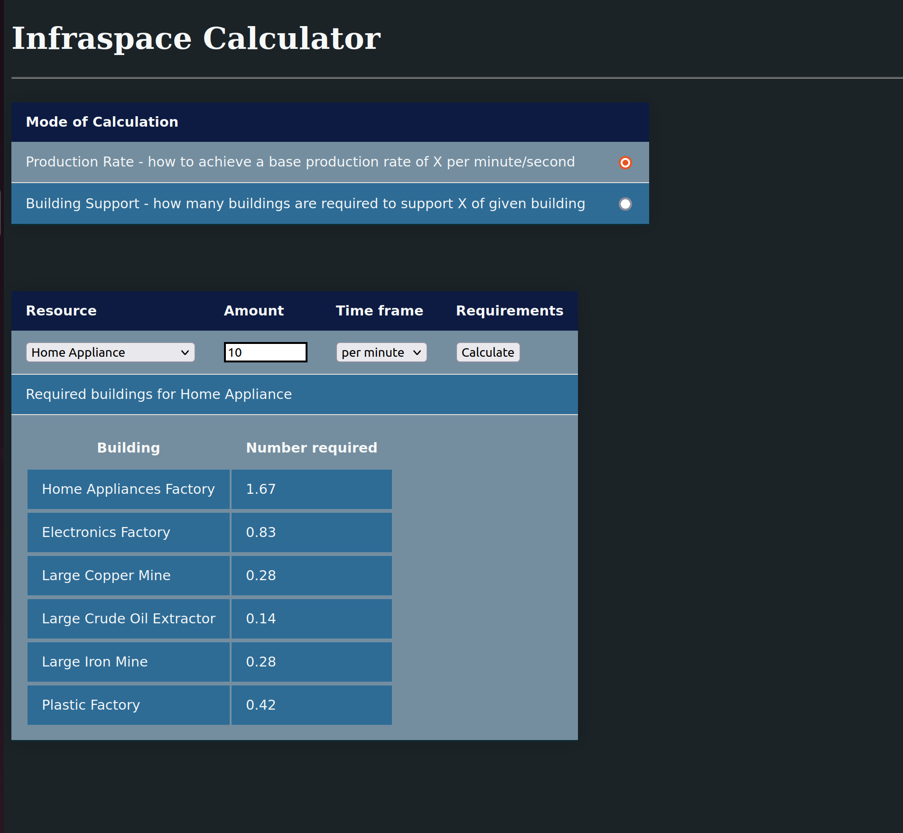
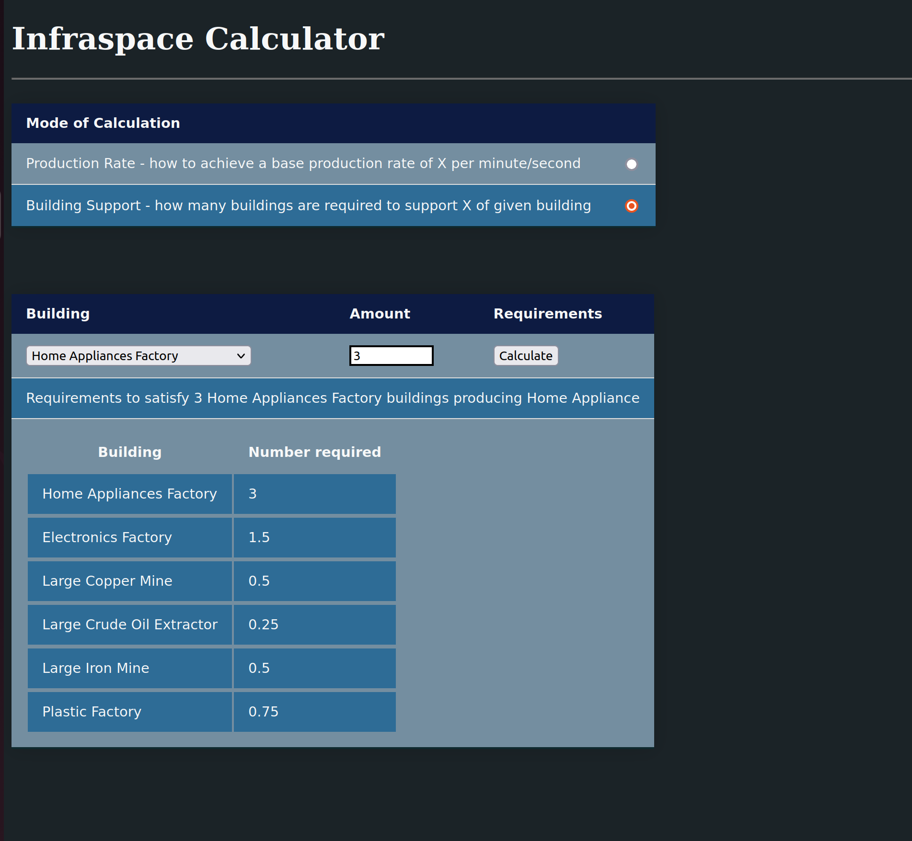

# Infraspace Calculator

Simple calculator for the game [InfraSpace](https://store.steampowered.com/app/1511460/InfraSpace/).

It is a simple HTML file that does not use any external links or resources. Everything is self contained, the HTML, the styling, the data and the calculator logic.

## Downloading the calculator

1. Right click `infraspace_calc.html` file and select `save as`
2. Save somewhere handy
3. Open it in your browser (eg. open file)

## Using the calculator is pretty simple

Choose a mode - production rate or building support

### Production Rate - How to satisfy a production rate of X per minute or second

1. Select a resource from the drop down box
2. Enter in the amount of the rate required
3. Choose the rate required (per second or per minute)
4. Hit the calculate button
5. The results show the number of buildings you need to have have in order to achieve the desired rate



### Building Support - How to support X of building type

1. Select a building from the drop down box
2. Enter in the amount of buildings
3. Hit the calculate button
4. The results show the number of buildings required to support your chosen building



## Caveats

- This does not take into account the efficiency bonuses from adjacent buildings
- This does not take into account the productivity boosts from research or special buildings
- This does not take into account traffic and delivery related issues
- This only uses the large miners, if you have not unlocked them yet, just double the number of small miners
- This uses the carbon processor, if you have not unlocked it yet, just double the number of atmosphere processors
- I am not taking into account the Waste products from the Vegetable and Meat Factories. I will try update this at a later point
- This does not cover the Spaceship component and repairs. Might do at a later stage
- Names of resources or buildings may be different in game due to how the game exports its data
- Organic Waste is treated slightly different since its a by product of useful buildings that you will have plenty of

In game, I think the production supply and consumption are given in "per minute" rate. It seems efficiency only decreases the time to process resource.

## Updates

From the steam guide page

- Fixed some recipes
- Added new building mode
- Added some simple styling (dark mode)
- Updated for Water and Methane

From github

- Updated for the release version, and added to git

## On using or extending using game data

If you would like to extend or use latest game data, this section provides the steps and information.

I'm using a linux enviroment (MacOS should be similar), I can't advise on any Windows development.

### Requirements

- git
- python
- nodejs
- text editor (I recommend vscode)

### Getting building.json

- Open infraspace game
- In main menu, click on Mods
- In mods menu, click on Export Config Files
- Game data files will be copied to a folder on your desktop
- Copy the `building.json` file to where ever you cloned this git repo

### Preparing the data {#preparing}

Unfortunately, at the time of writing, the json outputted by the game is malformed.

Use this nodejs package to clean the json:

To install:

``` bash
sudo npm install --global json5
```

To use:

```bash
json5 buildings.json > buildings2.json
```

### Processing the data

All the buildings are provided in the game data even those that do not produce or consume resources. Additionally, there is a lot more data than required for the calculator.

The required data is extracted, as such, I have provided a simple python script that outputs three javascript objects to be used in `infraspace_calc.html`.

The script assumes you have cleaned the json in the [Preparing the Data](#preparing) creating the `buildings2.json` (I was lazy).

Running the python script:

```bash
python3 extractBuildingData.py
```

The three js objects are:

- dataResources - a map of more readable resource names
- resourceBuildingMap - a map of resources to its production building
- data - map of building data

Within [infraspace_calc.html](infraspace_calc.html) replace the above objects with the output from the
